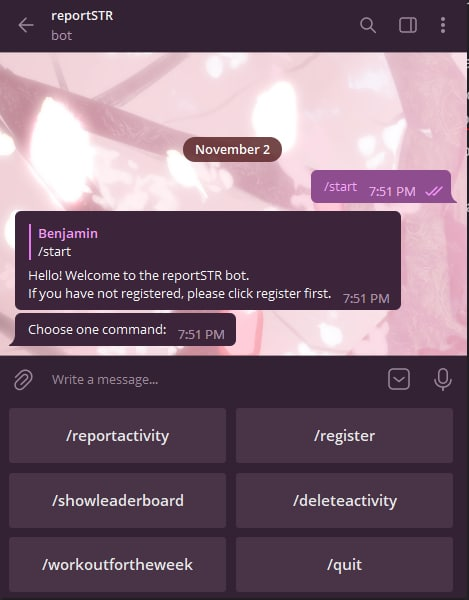
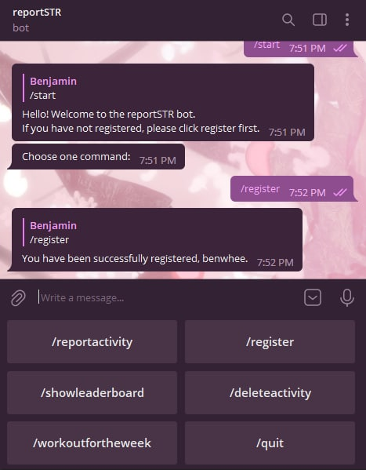
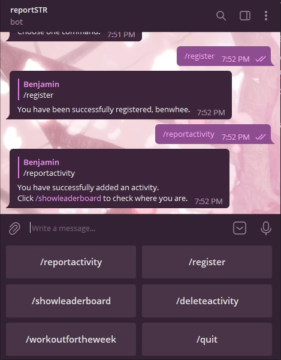
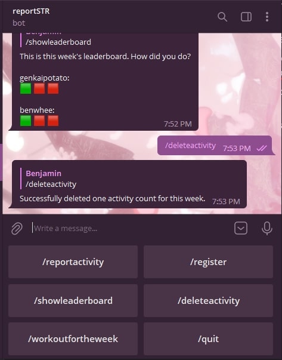
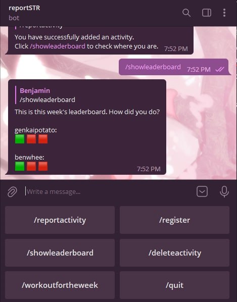
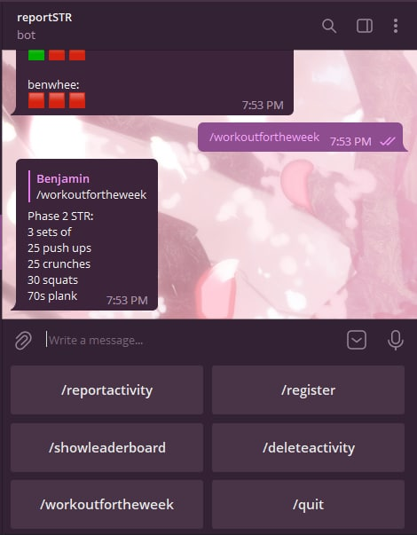

# reportSTR Bot

## About
The reportSTR bot is created for the reportSTR event. The event aims to improve the wellbeing and fitness of the participants, by motivating them to complete a given routine of exercises for a set number of times in a week. Basically, you have to report "strength" everyday.

The reportSTR Bot is a telegram bot that aims to help participants track their activity completion count, and see everyone's progress across the board. 

## Tech stack
- Python
- Flask
- Firebase Firestore
- Heroku
- Telegram Bot API

<table>
  <tr>
    <td>Starting the bot</td>
    <td>Registering for the event</td>
  </tr>
  <tr>
    <td></td>
    <td></td>
  </tr>
  
  <tr>
    <td>Reporting an activity</td>
    <td>Deleting a reported activity</td>
  </tr>
  <tr>
    <td></td>
    <td></td>
  </tr>

  <tr>
    <td>Showing the leaderboard</td>
    <td>Checking out the workout for the week</td>
  </tr>
  <tr>
    <td></td>
    <td></td>
  </tr>

  <tr>
    <td>Quitting the event</td>
  </tr>
  <tr>
    <td>Who says you can quit?</td>
  </tr>
</table>
